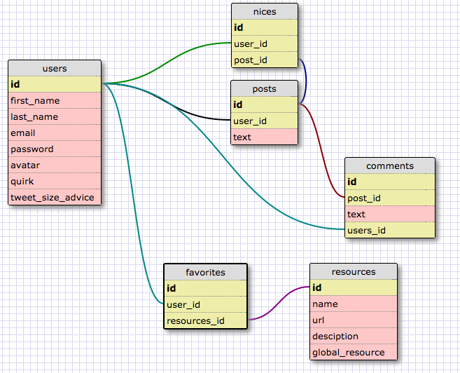

== README

This README would normally document whatever steps are necessary to get the
application up and running.

Things you may want to cover:

* Ruby version
  ruby 2.0.0p353 (2013-11-22 revision 43784) [x86_64-darwin13.4.0]

* System dependencies

* Configuration

* Database creation

* Database initialization
  db:create
  db:migrate
  db:seed

* How to run the test suite
  ```shell
  rails server
  ```
  then
  visit http://localhost:3000/ in web browser

* Services (job queues, cache servers, search engines, etc.)

* Deployment instructions

* ...


Please feel free to use a different markup language if you do not plan to run
<tt>rake doc:app</tt>.



#phasebook
phasebook is a social site for DBC students which is in early development.
##Site Features
  * Login & Sign up page
  * Home page
    * Current user's favorite resources
    * Posts feed
      * View other student's posts
      * Create a new post
      * Comment on posts
      * "Nice" aka "like" posts
  * DBC Resources
    * Can "favorite" a resource, which is added to user's profile

  * View and edit personal profile and favorite resources
  * View other user profiles

##login page


##home/feed page


##profile page


##resources page


To view more project details on [trello](https://trello.com/b/ZKeoZoIk/db-social) contact @galeforcevr, @luminous14, @rockrgrrl, or @schreuderjo.
